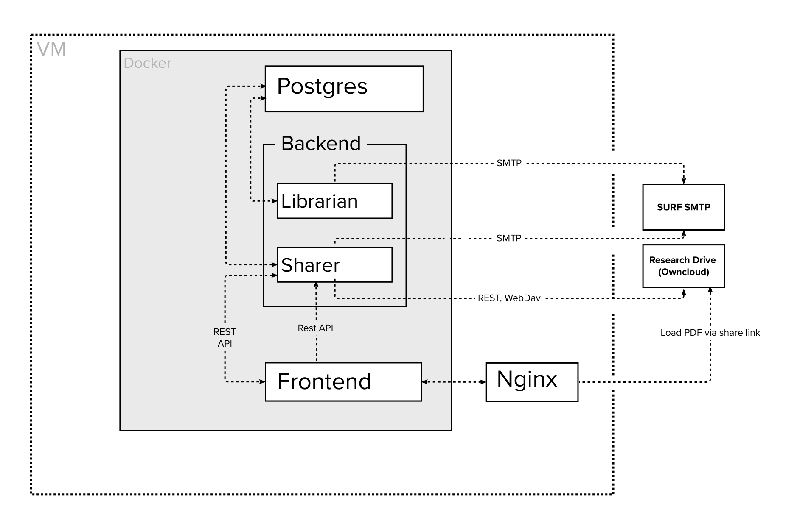

# Research Data Exchange

## Documentation for end users

- [How to register a dataset in RDX](./docs/register-dataset.md);
- [How to publish a dataset from Figshare (for Data Stewards)](./docs/publish-dataset-figshare-as-data-steward.md);

## Documentation for developers

- [Running RDX on your machine](./docs/developers/running-rdx-on-your-machine.md);
- Backend v1 (Scala) [README](./backend/v1/README.md);
- Backend v2 (Python) [README](./backend/v2/README.md);
- Frontend [README](./frontend/README.md);
- Deployment scripts [README](./deploy/README.md);
- CI/CD [.gitlab-ci](./.gitlab-ci);
- [Source code editors configuration example](./docs/developers/source-code-editors.md).
