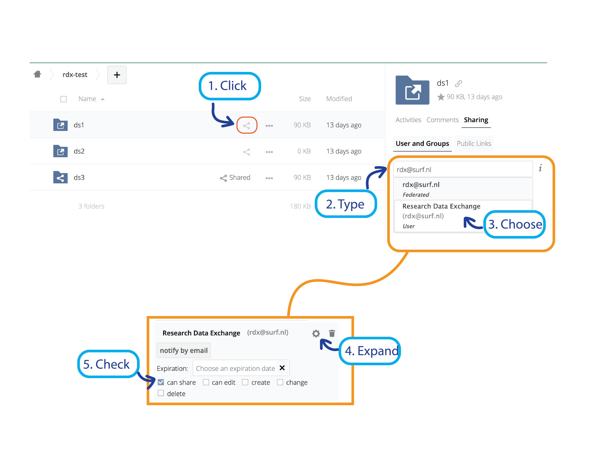

# Instructions Data Publication: Data Steward

1. Find the researchers dataset in UvA Figshare by login in to your own UvA Figshare account on: [https://uvaauas.figshare.com](https://uvaauas.figshare.com);

2. Click on your initials and go to “Administration”;

3. Select “Users” and type in the last name of the researchers account you wish to access;

4. Access his or her account by clicking the cogwheel;

5. Open the metadata form by clicking the the correct item (based on the Google Survey);

6. Download the dataset files and store them in a temporary place (e.g., OneDrive);

7. Go to your Research Drive and create a new folder: [https://researchdrive.surfsara.nl/index.php/login](https://researchdrive.surfsara.nl/index.php/login);

8. Add the data and the RDX contract (conditions.pdf, these are attached to the invitation email) to this folder (and possibly other files);

9. Go back to Figshare and remove the dataset files from Figshare;

10. Select "Metadata record only" at the the top of the metadata form on Figshare;

11. Select "RDX License" in the license field;

12. Generate a DOI, but do not publish the metadata on Figshare just yet;

13. Go back to the folder you made in the Research Drive and share it with RDX:

    1. Click the "Share" icon;
    2. Type *rdx@surf.nl*;
    3. Choose "Research Data Exchange (rdx@surf.nl) User";
    4. Expand additional settings by clicking on the cogwheel;
    5. Check "can share".

    (see screenshot further down)

14. Follow the instructions in the RDX email;

15. Fill in the metadata form provided by RDX by copying metadata from Figshare;

16. After filling in all the blanks you can submit the form;

17. You will now receive the “access request” link to the data;

18. Please add this link under references in Figshare;

19. Lastly publish the project in Figshare;

20. Now you are all done, and can notify the researcher about their new publication!
