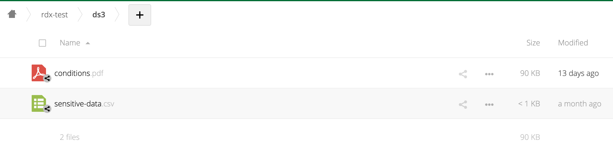
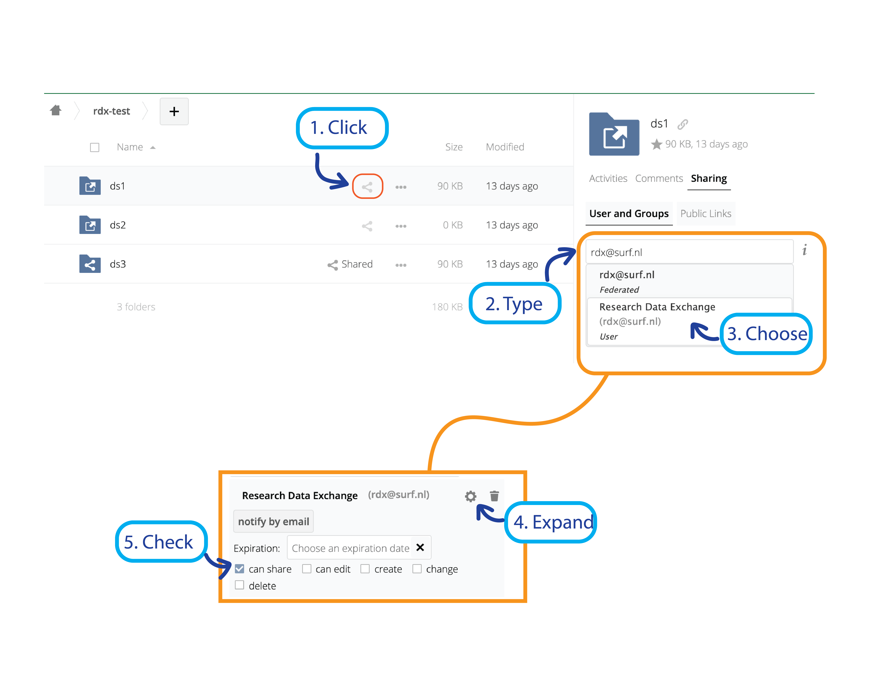

# Registering a dataset at RDX

Before you can _publish_ a dataset, RDX has to receive read access to the dataset files to delegate this access to the interested parties that accept the use conditions. You do that by _registering a dataset_.

## How to register a dataset

1. Ensure you have an account at [SURF Research Drive](https://researchdrive.surfsara.nl/index.php/login) with sufficient disk space quota;
2. Upload the dataset as a single folder that contains all files of the dataset along with the _use conditions_ file named _conditons.pdf_;

3. When the folder is there, please share it with *rdx@surf.nl*;

4. You'll receive an email with a publication URL that is valid for 48 hours. Follow the link to the publication page.

## The publication URL is valid for 48 hours only.

If you didn't receive the link, unshare the dataset, wait for a couple of minutes and share it with RDX again. You should receive a new publication URL that you can use.
